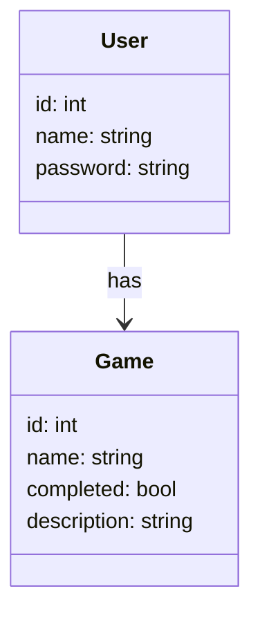

# Projeto Todo Games

## Objetivo do projeto:

O objetivo do projeto é criar uma lista de jogos relacionada ao usuario, onde você pode adicionar o jogo que você deseja finalizar, e quando finalizado você poderá marcar como finalizado!

## Diagrama de Classes:

